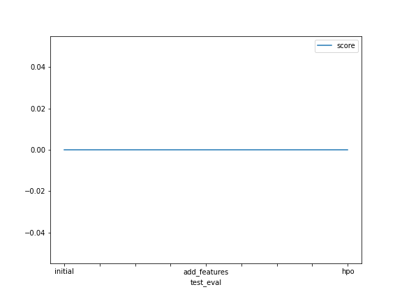

# Report: Predict Bike Sharing Demand with AutoGluon Solution
#### Hugo Albuquerque Cosme da Silva

## Initial Training
### What did you realize when you tried to submit your predictions? What changes were needed to the output of the predictor to submit your results?
Predictions can not be smaller than zero. Otherwise they are rejected by kaggle. It was necessary to set negative predictions to 0.

### What was the top ranked model that performed?
The best performing model was WeightedEnsemble_L3. As the name suggest, it is an ensemble method, which generates predictions
through an weigthed average of the predictions of L2(layer 2) models. It achieved an RMSE of 28.912493. 

## Exploratory data analysis and feature creation
### What did the exploratory analysis find and how did you add additional features?
It showed that values in the datetime column are approximately uniform distributed. Columns 'season', 'wheater' are already encoded as integers and
needed to be casted into the 'category' type. Columns 'temp' and 'atemp' seems to follow a normal distribution. As features engineering steps, the datetime column was used
to generate month, day, and hour columns.

### How much better did your model preform after adding additional features and why do you think that is?
the best model in the first iteration had an RMSE score of 50.33. After adding the features and parsing the categorical columns,
the best model of the second interation achieved an RMSE score 28.91. Adding time features likely allowed the model to learn interesting correlations
between the count of rented bikes and the hour of the day, the day and month. It might have also helped it learned trend an seasonality patterns that end up
influencing the counts.

## Hyper parameter tuning
### How much better did your model preform after trying different hyper parameters?
Interestingly the model performed slightly worse than in the second iteration. The best model had a RMSE of 29.00. Two possibilities might have ocurred:
1. I have not defined the hyperparameter search space properly, like not setting an adequate range of values for the hyperparameters
2. I have run the tuning job for a very short time(only 15 min). This might not have been enough for the job to search for all, or at least most
of the hyperparamter search space, resulting in a suboptimal solution.

### If you were given more time with this dataset, where do you think you would spend more time?
I would try testing a wider range of values for the hyperparameters.
I would also focus on the hyperparameters of the types of models that performed better in the third interaction, so I could fine tune them.

### Create a table with the models you ran, the hyperparameters modified, and the kaggle score.
|model|hpo1|hpo2|hpo3|score|
|--|--|--|--|--|
|initial|?|?|?|?|
|add_features|?|?|?|?|
|hpo|?|?|?|?|

### Create a line plot showing the top model score for the three (or more) training runs during the project.

TODO: Replace the image below with your own.

### Create a line plot showing the top kaggle score for the three (or more) prediction submissions during the project.

TODO: Replace the image below with your own.

## Summary
This project showcased the use of AutoMl to predict the count of rented bikes given features like date, time of the day, season, weather, temperature, etc. For this, we used
autogluon's TabularPredictor to find the best model. It was performed some basic feature engineering, demonstrating how helpful it can be in improving model performance. A final
step was to perform hyperparameter tuning by specifying different model variations that the TabularPredictor should try to fit.